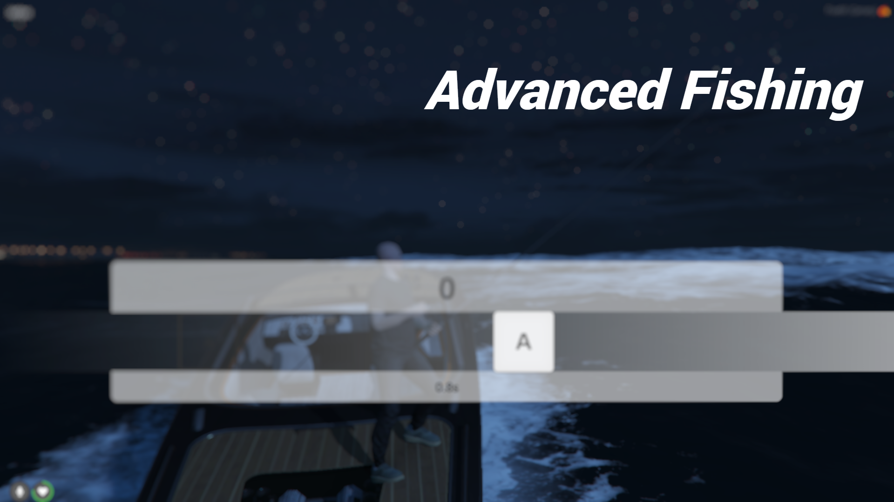
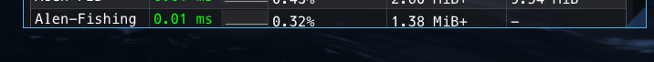
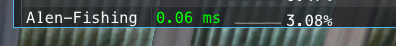
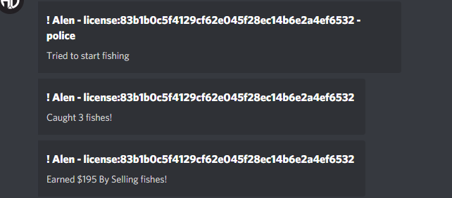

# Alen-Fishing

**Preview** : https://www.youtube.com/watch?v=PfkbaleHIms

###Installation
- Download the source code
- Extract and ensure the resource
- Add an item fishingrod 

### Dependency
- [Keymaster Minigame](https://github.com/dsheedes/cd_keymaster)

### ESX-Version : 

###Resmon Useage :
- Idle/While Catching Fish

- While near text

### Discord Logs : 

